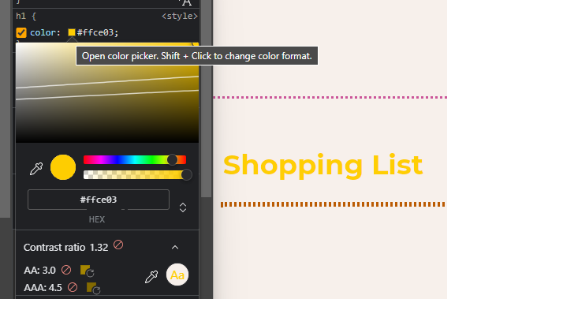
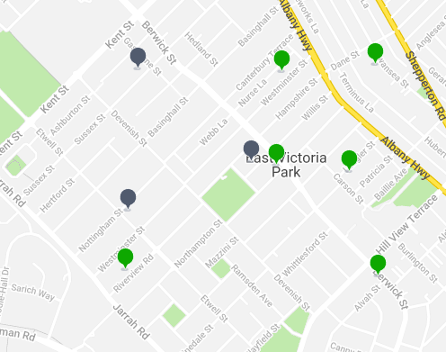

# Accessibility Testing

For Accessibility testing, some of it can be automated but some tests must be conducted manually. There are plenty of manual tests that can easily be run with little or no experience in the accessibility field.

## Guidelines

To make our experiences more accessible, we can refer to the **************************************************************************Web Content Accessibility Guidelines************************************************************************** (********WCAG********), which are developed by the **************World Wide Web Consortium************** (******W3C******), who is an international community of experts (some staff, some community) who develop the web standards we use. The current version of guidelines is 2.1 which was published in 2018, but version 2.2 is due to come out later this year.

The WCAG guidelines have 3 different levels of conformance:

- **A**: the bare minimum, most sites meet this level if their site is mostly accessible but not necessarily convenient for people with disabilities to use
- ****AA****: the general standard, if you’re looking to make your website accessible, this is the level you’re working towards
- ******AAA******: the highest standard, generally followed by companies whose websites are for people with disabilities

Under the WCAG guidelines there are sets of specifications on what you can and can’t do to make sure your website is accessible, some are only relevant to a certain level, (eg. the section on pronunciation is relevant only to the AAA level) while others will have different standards for different levels (eg. colour contrast has stricter requirements for AAA than for AA).

## Colour Contrast

Colour contrast refers to the difference (or contrast) between the foreground and background colours, whether you can easily distinguish between the two. WCAG [AA standard](https://www.w3.org/WAI/WCAG21/Understanding/contrast-minimum.html) says we need at least a `4.5:1` ratio between two different colours for them to pass and AAA requires at least `7:1` to pass.

One of the best tools for checking this is the browser dev tools, which will give contrast ratios when opening the colour picker, Microsoft Edge even has lines overlaying over the colour char to show where the acceptable ratios kick in.



Colour contrast is easy to achieve when it’s done at the initial design stages, and tools like [Accessible Brand Colors](https://abc.useallfive.com/?colors[]=318CE7,9440A0,64AD66,7561C1,E53F51,FFCE03,364C93,F7F0EB,191919) allow comparing all brand colours to find acceptable combinations

](./img/a11y_1.png)

[Accessible Brand Colors by Use All Five](https://abc.useallfive.com/?colors[]=318CE7,9440A0,64AD66,7561C1,E53F51,FFCE03,364C93,F7F0EB,191919)

Just because a colour combination passes that also doesn’t mean it’s a good combination to use, for example people with various types of colour blindness or vision impairments may have issues as they view the colours differently, [WhoCanUse](https://www.whocanuse.com/?bg=b8192a&fg=bfdfbf&fs=16&fw=) simulates various types of vision impairments and tests the colour contrast of them as well to make sure that it’s good for everyone.

](./img/a11y_2.png)

[WhoCanUse](https://www.whocanuse.com/?bg=b8192a&fg=bfdfbf&fs=16&fw=)

<aside>
👩🏾‍💻 Using one of these (or another) tools, find some non-passing colour combinations.
🏆 ************Worst Combination (must be on the internet somewhere)************ and *************************************************************Best “Technically” Passes but sucks for vision impairments*************************************************************

</aside>

## Keyboard Testing

We spend a lot of time using the keyboard and it’s always a pain if you can’t use your keyboard to navigate through things or keyboard shortcuts are overridden. Imagine if you didn’t have a mouse and keyboard navigation was your only option, but people keep messing with it

If an element can be clicked on, or has `:hover` styles, it should have `:focus` styles as well (ideally different ones). If someone is navigating with their keyboard they should know where on the page they are and what would happen if they hit Enter.


Focus indicators help signify which element you’ve got selected or are working with.

This also relates to using `[tabindex](https://developer.mozilla.org/en-US/docs/Web/HTML/Global_attributes/tabindex)` as well, or rearranging the DOM so it’s in a different order to how it visually appears on the page. This can be jarring for people who are navigating with a keyboard but watching the screen, where the focus doesn’t go where they expect it to.

<aside>
👩🏾‍💻 Try using your keyboard alone to navigate around a few websites, can you do everything you normally would? Do you know where you are?
🏆 ******Best ******WTF****** messing with focus indicators and/or tabindex*

</aside>

## Notifying with Colour

Colour can be a useful shorthand, but we should never rely on it alone to convey information to our users. For example, these two form inputs have validated and changed the border colour to reflect valid and invalid content, can you tell which one is which?


Even without talking about colour blindness or vision impairments, many people adjust the settings on the device to ease the eye strain, here’s an example of the impact of night mode when trying to buy a house, colour is the only thing differentiating the options and once that’s gone even though you can see different shades of grey, you don’t know which is which.



Map view of potential houses to buy, grey pins have been looked at and green haven’t


Same map view, but with night mode on the screen

Although colour is powerful, it should always be accompanied by text, and useful messages for the users.

## WaVE and aXe

<aside>
👩🏾‍💻 Check out the [WAVE](https://wave.webaim.org/) and [axe](https://www.deque.com/axe/) browser extensions or dev tools integrations, run over a few different websites and use it to identify some of the accessibility issues.

</aside>

## Screen Readers

There are a bunch of different screen readers, but most devices have them built in and for the purpose of starting to learn screen reader testing that’s suitable for the purpose.


Windows has Narrator built in and can be found in settings under **************************Accessibility************************** → ****************Narrator****************


Mac OSX and iOS have VoiceOver built in, on Mac it can be found in settings under **************************Accessibility************************** → ******************VoiceOver****************** or can be enabled via the `CMD + F5` keyboard shortcut

<aside>
👩🏾‍💻 Plug in some headphones and try out using the screen reader to navigate around some webpages. See if you can ignore your mouse altogether and close your eyes.
****Hint****: Make sure you remember how to turn the screen reader on and off, otherwise once it’s on you may struggle to turn it off again

</aside>

This kind of screen reader testing is really valuable to get a better understanding of how the code we right is interpreted and communicated to users of assistive technologies. That being said, this does not fully replace or even replicate how people use these technologies every day.

[Screen reader demo with Jordie](https://youtu.be/WSEe2zxjslw)

<aside>
👩🏾‍💻 Watch this video of someone using a screen reader, consider the difference between their use and yours

</aside>

## pa11y

There are a lot of accessibility issues that need to be tested manually, and vetted by a person, but that doesn’t mean you shouldn’t do automated testing. Automated tests can still catch a lot of issues like validating the HTML structure, but sometimes the results need to be taken with a grain of salt and manually checked (eg. colour contrast checking can give false positives).

Pa11y can be run as a [CLI tool](https://github.com/pa11y/pa11y#command-line-interface) or a [JavaScript](https://github.com/pa11y/pa11y#javascript-interface) package, for now we’re going to use the JavaScript option as it gives us a bit more control. The package gives us an async function, we can pass the site URL to it and have it run the tests on the website.

```jsx
const pa11y = require('pa11y');

pa11y('https://mywebsite.com')
	.then((results) => {
		console.log({ results })
	})
	.catch((err) => {
		console.log({ err });
	})
```

> 👩🏾‍💻 Create a pa11y test that runs against the local server (will probably be http://localhost:3000) and logs the results to the console
> 

We can also save the results to a file and make it easier to read through and access them using the `file-system` package.

```jsx
const pa11y = require('pa11y');
const fs = require('file-system')

pa11y('https://mywebsite.com')
	.then((results) => {
		fs.writeFileSync(
			`results.json`, 
			JSON.stringify(res, null, 4)
		)
	})
	.catch((err) => {
		console.log({ err });
	})
```

> 👩🏾‍💻 Update the test to save the results in a JSON file in the `tests/a11y/results` folder.
> 

The results we get back look a little like this, giving us information about the error and where to find it.

```json
"code": "WCAG2AA.Principle1.Guideline1_1.1_1_1.H37",
"type": "error",
"typeCode": 1,
"message": "Img element missing an alt attribute. Use the alt attribute to specify a short text alternative.",
"context": "",
"selector": "html > body > main > article > article:nth-child(1) > img",
"runner": "htmlcs",
"runnerExtras": {}
```

The important parts of this error message are just four of these properties, which give us enough information about the error and where it is.

```json
"code", // The WCAG Guideline in question
"message", // An error message, what the problem is
"context", // The element in question
"selector", // The CSS selector to find the element
```

If we need to find more information, we can search for the error code in the WCAG standards, to find more information about how to fix it.

](./img/a11y_9.png)

[squizlabs.github.io/HTML_CodeSniffer/Standards/WCAG2](http://squizlabs.github.io/HTML_CodeSniffer/Standards/WCAG2)

> 👩🏾‍💻 Find 2 errors that exist on your page, and work out what the issue is. If you can fix it, do so, otherwise make a note of what the fix needs to be.
> 

At the moment we’re just testing out of the box, but there are a bunch of configuration options that we can use in the test. For example we can customise/define:

```jsx
const options = {
	actions, // Perform actions on the page before testing, eg. filling in forms or clicking on things
	headers, // Customise the headers of the request
	rootElement, // Run tests on a component rather than the whole page
	screenCapture, // Take a screenshot of the test page
	standard, // Change the WCAG standard to test, eg. A, AA or AAA
	viewport, // Change the size of the screen the test is run on
}

pa11y(url, options)
```

> 👩🏾‍💻 There are some default options in the `tests/a11y/pa11y.config` file, import them and add them to the test. Then try adding your own.
> 

As pa11y is being run as a JavaScript function, we can also use this to our advantage to run multiple tests.

```jsx
Promise.all([
	pa11y(url, options),
	pa11y(anotherUrl, options),
])
	.then(res => {
		res.forEach(test => {
			fs.writeFileSync(
				`${test.pageUrl}.json`, 
				JSON.stringify(test, null, 4)
			)
		})
	})
	.catch(err => {
		console.log({err})
	})
```

> 👩🏾‍💻 Using `Promise.all()`, run tests against two different pages, and another one with a smaller viewport size.
>